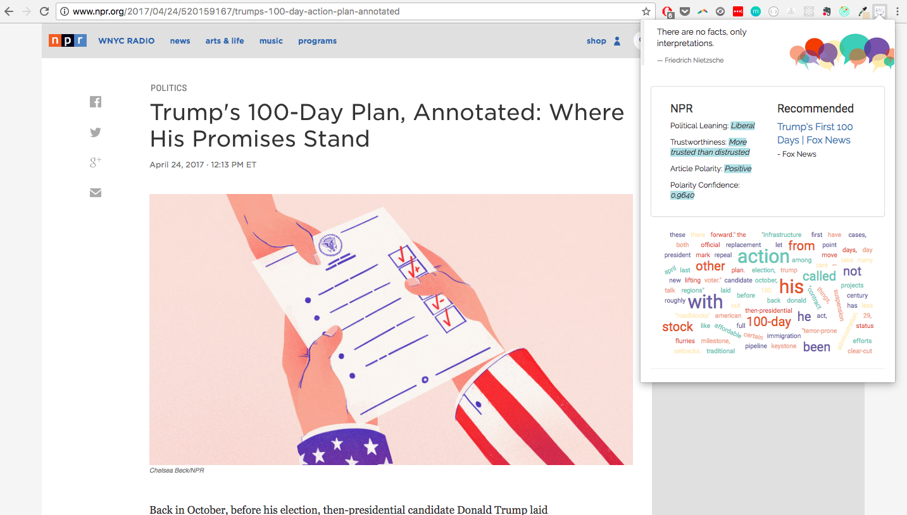

# Bubble Burst

Bubble Burst is a Chrome extension app that helps users get out of their political bubbles. While reading a news article,
Bubble Burst will provide information on the article including the news source's political leaning and trustworthiness.
The app will also recommend another article on the same topic from a news source with a different political leaning.

BubbleBurst was built with Javascript, HTML5, CSS3, jQuery, Browserify, Aylien Text, and wordCloud2.js.

[Video Demo](https://youtu.be/a9IGx-Vmj6c)

